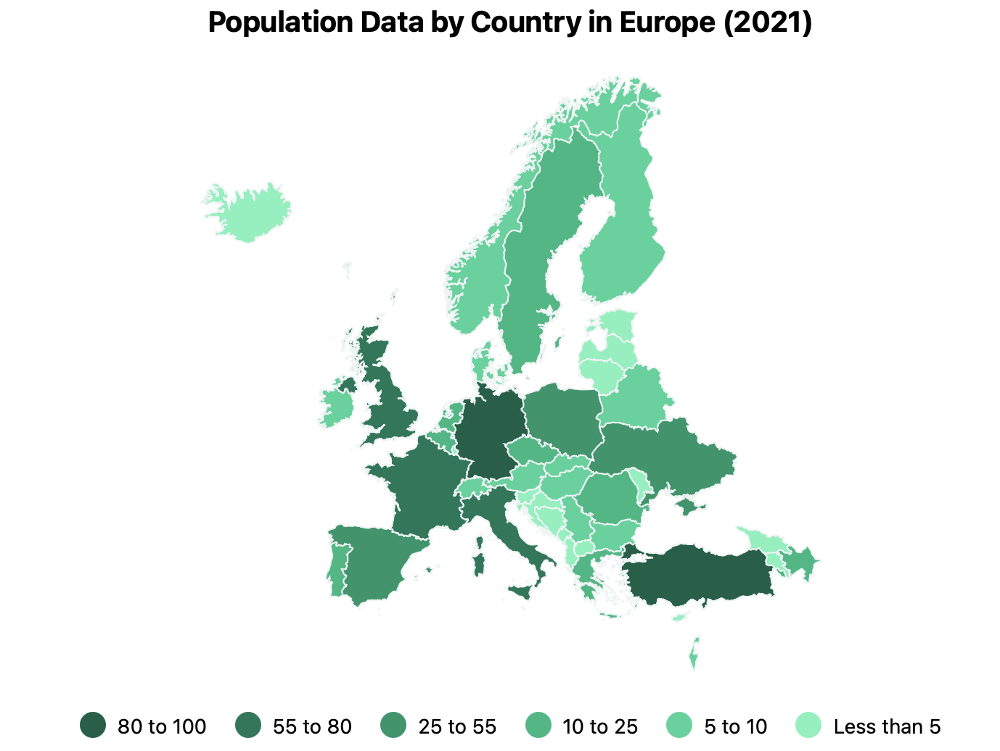

# @dkkoval/react-eu-stats-map

A React component for visualizing data on a map of Europe by country. This package makes it easy
to present regional data visually, providing a choropleth map representation of European countries.



## Features

- Display a map of Europe with individual countries colored based on provided data.
- Supports tooltip interactions to display additional information about each country.
- Easy integration with responsive container components to make the map adjust to the size of the parent.

## Installation

To install the package, use npm or yarn:

```sh
npm install @dkkoval/react-eu-stats-map
```

or

```sh
yarn add @dkkoval/react-eu-stats-map
```

## Usage

Here is an example of how to use the `EUMap` component in a React application.

### Example

```jsx
import populationJson from './population.json';
import EUMap, { getCountryCode, CountryCode } from '@dkkoval/react-eu-stats-map';

// Assuming the json file has title and value name
interface StatsData {
  title: string;
  valueName: string;
  data: {
    [region: CountryCode]: number;
  };
}

// Helper function to convert region names to country codes
function transformDataKeys(data: Record<string, number>): Record<CountryCode, number> {
  const transformedData: Partial<Record<CountryCode, number>> = {};

  Object.entries(data).forEach(([key, value]) => {
    const code = getCountryCode(key);
    if (code) {
      transformedData[code] = value;
    }
  });

  return transformedData as Record<CountryCode, number>;
}

function App() {
  const { data: rawData, title, valueName }: StatsData = populationJson;

  const data = transformDataKeys(rawData);

  return (
    <div className='App' style={{
      width: '90vw',
      height: '90vh',
      border: '1px solid #eee',
      display: 'flex',
      justifyContent: 'center',
      alignItems: 'center',
      margin: '24px',
    }}>
      <EUMap
        width={800}
        height={500}
        title={title}
        valueName={valueName}
        data={data}
      />
    </div>
  );
}

export default App;
```

### Props

- **width**: The width of the map (number).
- **height**: The height of the map (number).
- **title**: A string to display as the map title.
- **valueName**: The unit or type of data being visualized (e.g., "millions people").
- **data**: An object representing the values to display for each country, where the keys are country codes and values are numerical data.

### Country Codes

The `data` prop should use country codenames as keys to identify different regions. The country codes used are:

| Country Name           | Code |
| ---------------------- | ---- |
| Azerbaijan             | AZ   |
| Albania                | AL   |
| Armenia                | AM   |
| Bosnia and Herzegovina | BA   |
| Bulgaria               | BG   |
| Cyprus                 | CY   |
| Denmark                | DK   |
| Ireland                | IE   |
| Estonia                | EE   |
| Austria                | AT   |
| Czech Republic         | CZ   |
| Finland                | FI   |
| France                 | FR   |
| Georgia                | GE   |
| Germany                | DE   |
| Greece                 | GR   |
| Croatia                | HR   |
| Hungary                | HU   |
| Iceland                | IS   |
| Israel                 | IL   |
| Italy                  | IT   |
| Latvia                 | LV   |
| Belarus                | BY   |
| Lithuania              | LT   |
| Slovakia               | SK   |
| Liechtenstein          | LI   |
| North Macedonia        | MK   |
| Malta                  | MT   |
| Belgium                | BE   |
| Faroe Islands          | FO   |
| Andorra                | AD   |
| Luxembourg             | LU   |
| Monaco                 | MC   |
| Montenegro             | ME   |
| Netherlands            | NL   |
| Norway                 | NO   |
| Poland                 | PL   |
| Portugal               | PT   |
| Romania                | RO   |
| Moldova                | MD   |
| Slovenia               | SI   |
| Spain                  | ES   |
| Sweden                 | SE   |
| Switzerland            | CH   |
| Turkey                 | TR   |
| United Kingdom         | GB   |
| Ukraine                | UA   |
| San Marino             | SM   |
| Serbia                 | RS   |
| Vatican City           | VA   |

### Helper Functions

- **getCountryCode(name: string): CountryCode | undefined**: Converts a string representing the country name into the corresponding country code. This function is useful for transforming user-provided or external data to match the required format.

## License

This project is licensed under the Apache-2.0 License. See the [LICENSE](LICENSE.txt) file for details.

## Contributing

Contributions are welcome! Feel free to open an issue or submit a pull request if you have any suggestions or improvements.

## Contact

Created by Dmytro Koval. You can reach out via GitHub for any questions or feedback.
