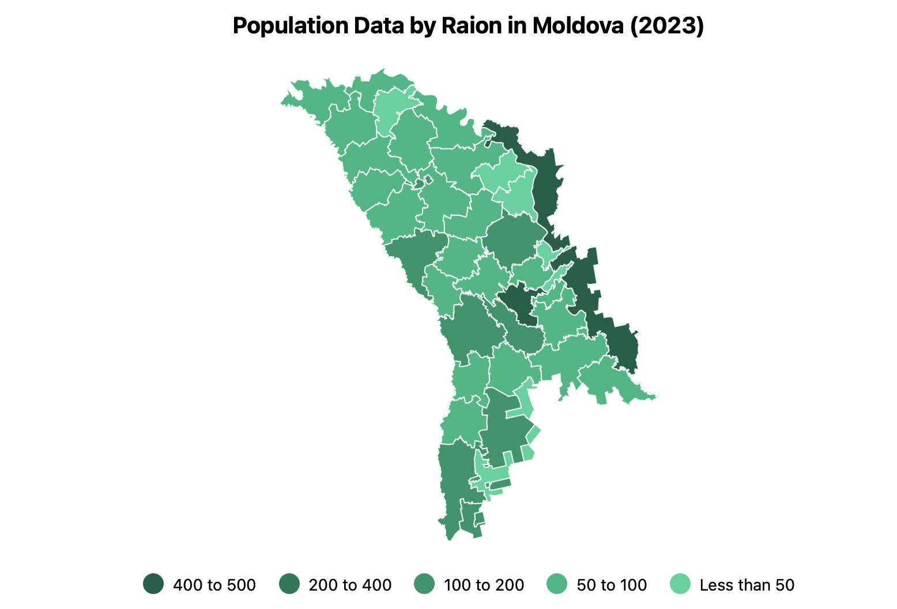

# @dkkoval/react-md-stats-map

A React component for visualizing data on a map of Moldova by raion. This package makes it easy
to present regional data visually, providing a choropleth map representation of Moldovan raions (regions).



## Features

- Display a map of Moldova with individual raions colored based on provided data.
- Supports tooltip interactions to display additional information about each raion.
- Easy integration with responsive container components to make the map adjust to the size of the parent.

## Installation

To install the package, use npm or yarn:

```sh
npm install @dkkoval/react-md-stats-map
```

or

```sh
yarn add @dkkoval/react-md-stats-map
```

## Usage

Here is an example of how to use the `MDMap` component in a React application.

### Example

```jsx
import populationJson from './population.json';
import MDMap, { getRaionCode, RaionCode } from '@dkkoval/react-md-stats-map';

// Assuming the json file has title and value name
interface StatsData {
  title: string;
  valueName: string;
  data: {
    [region: RaionCode]: number;
  };
}

// Helper function to convert region names to raion codes
function transformDataKeys(data: Record<string, number>): Record<RaionCode, number> {
  const transformedData: Partial<Record<RaionCode, number>> = {};

  Object.entries(data).forEach(([key, value]) => {
    const code = getRaionCode(key);
    if (code) {
      transformedData[code] = value;
    }
  });

  return transformedData as Record<RaionCode, number>;
}

function App() {
  const { data: rawData, title, valueName }: StatsData = populationJson;

  const data = transformDataKeys(rawData);

  return (
    <div className='App' style={{
      width: '90vw',
      height: '90vh',
      border: '1px solid #eee',
      display: 'flex',
      justifyContent: 'center',
      alignItems: 'center',
      margin: '24px',
    }}>
      <MDMap
        width={800}
        height={500}
        title={title}
        valueName={valueName}
        data={data}
      />
    </div>
  );
}

export default App;
```

### Props

- **width**: The width of the map (number).
- **height**: The height of the map (number).
- **title**: A string to display as the map title.
- **valueName**: The unit or type of data being visualized (e.g., "millions people").
- **data**: An object representing the values to display for each raion, where the keys are raion codes and values are numerical data.

### Raion Codes

The `data` prop should use raion codenames as keys to identify different regions. The raion codes used are:

| Raion Name   | Code |
| ------------ | ---- |
| Cahul        | CA   |
| Găgăuzia     | GA   |
| Taraclia     | TA   |
| Cantemir     | CT   |
| Basarabeasca | BS   |
| Leova        | LE   |
| Cimișlia     | CM   |
| Ştefan Vodă  | SV   |
| Bender       | BD   |
| Căușeni      | CS   |
| Hîncești     | HI   |
| Ialoveni     | IA   |
| Nisporeni    | NI   |
| Chișinău     | CU   |
| Anenii Noi   | AN   |
| Criuleni     | CR   |
| Strășeni     | ST   |
| Ungheni      | UN   |
| Dubăsari     | DU   |
| Călărași     | CL   |
| Transnistria | SN   |
| Fălești      | FA   |
| Orhei        | OR   |
| Glodeni      | GL   |
| Bălți        | BA   |
| Telenești    | TE   |
| Sîngerei     | SI   |
| Rîșcani      | RI   |
| Rezina       | RE   |
| Şoldănești   | SD   |
| Florești     | FL   |
| Drochia      | DR   |
| Edineț       | ED   |
| Briceni      | BR   |
| Soroca       | SO   |
| Dondușeni    | DO   |
| Ocnița       | OC   |

### Helper Functions

- **getRaionCode(name: string): RaionCode | undefined**: Converts a string representing the raion name into the corresponding raion code. This function is useful for transforming user-provided or external data to match the required format.

## License

This project is licensed under the Apache-2.0 License. See the [LICENSE](LICENSE.txt) file for details.

## Contributing

Contributions are welcome! Feel free to open an issue or submit a pull request if you have any suggestions or improvements.

## Contact

Created by Dmytro Koval. You can reach out via GitHub for any questions or feedback.
