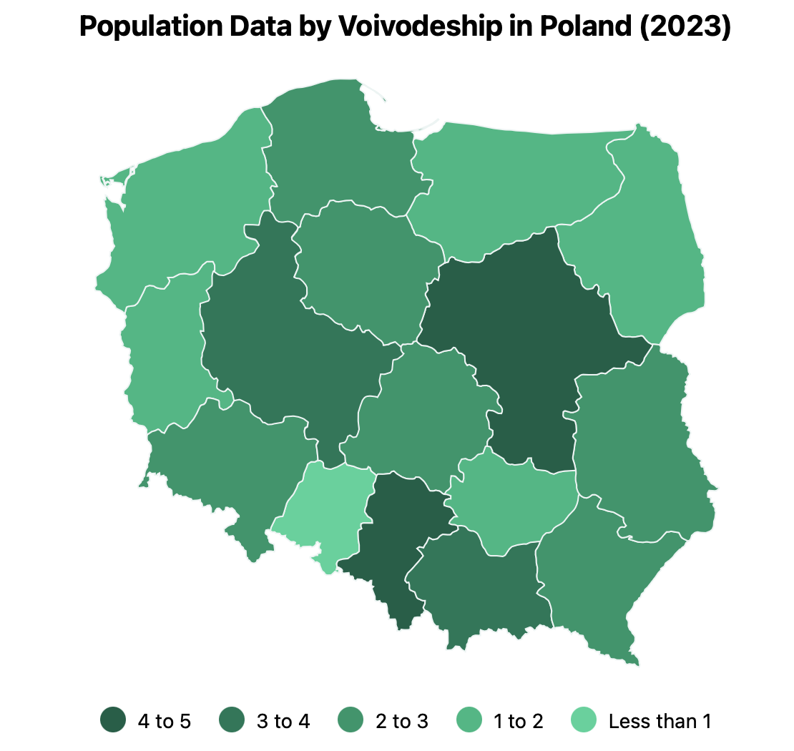

# @dkkoval/react-pl-stats-map

A React component for visualizing data on a map of Poland by voivodeship. This package makes it easy
to present regional data visually, providing a choropleth map representation of Poland voivodeship (regions).



## Features

- Display a map of Poland with individual voivodeships colored based on provided data.
- Supports tooltip interactions to display additional information about each voivodeship.
- Easy integration with responsive container components to make the map adjust to the size of the parent.

## Installation

To install the package, use npm or yarn:

```sh
npm install @dkkoval/react-pl-stats-map
```

or

```sh
yarn add @dkkoval/react-pl-stats-map
```

## Usage

Here is an example of how to use the `PLMap` component in a React application.

### Example

```jsx
import populationJson from './population.json';
import PLMap, { getVoivodeshipCode, VoivodeshipCode } from '@dkkoval/react-pl-stats-map';

// Assuming the json file has title and value name
interface StatsData {
  title: string;
  valueName: string;
  data: {
    [region: VoivodeshipCode]: number;
  };
}

// Helper function to convert region names to voivodeship codes
function transformDataKeys(data: Record<string, number>): Record<VoivodeshipCode, number> {
  const transformedData: Partial<Record<VoivodeshipCode, number>> = {};

  Object.entries(data).forEach(([key, value]) => {
    const code = getVoivodeshipCode(key);
    if (code) {
      transformedData[code] = value;
    }
  });

  return transformedData as Record<VoivodeshipCode, number>;
}

function App() {
  const { data: rawData, title, valueName }: StatsData = populationJson;

  const data = transformDataKeys(rawData);

  return (
    <div className='App' style={{
      width: '90vw',
      height: '90vh',
      border: '1px solid #eee',
      display: 'flex',
      justifyContent: 'center',
      alignItems: 'center',
      margin: '24px',
    }}>
      <PLMap
        width={800}
        height={500}
        title={title}
        valueName={valueName}
        data={data}
      />
    </div>
  );
}

export default App;
```

### Props

- **width**: The width of the map (number).
- **height**: The height of the map (number).
- **title**: A string to display as the map title.
- **valueName**: The unit or type of data being visualized (e.g., "millions people").
- **data**: An object representing the values to display for each voivodeship, where the keys are voivodeship codes and values are numerical data.

### Voivodeship Codes

The `data` prop should use voivodeship codenames as keys to identify different regions. The voivodeship codes used are:

| Voivodeship Name    | Code |
| ------------------- | ---- |
| Lódzkie             | LD   |
| Swietokrzyskie      | SK   |
| Wielkopolskie       | WP   |
| Kujawsko-Pomorskie  | KP   |
| Malopolskie         | MA   |
| Dolnoslaskie        | DS   |
| Lubelskie           | LU   |
| Lubuskie            | LB   |
| Mazowieckie         | MZ   |
| Opolskie            | OP   |
| Podlaskie           | PD   |
| Pomorskie           | PM   |
| Slaskie             | SL   |
| Podkarpackie        | PK   |
| Warminsko-mazurskie | WN   |
| Zachodniopomorskie  | ZP   |

### Helper Functions

- **getVoivodeshipCode(name: string): VoivodeshipCode | undefined**: Converts a string representing the voivodeship name into the corresponding voivodeship code. This function is useful for transforming user-provided or external data to match the required format.

## License

This project is licensed under the Apache-2.0 License. See the [LICENSE](LICENSE.txt) file for details.

## Contributing

Contributions are welcome! Feel free to open an issue or submit a pull request if you have any suggestions or improvements.

## Contact

Created by Dmytro Koval. You can reach out via GitHub for any questions or feedback.
