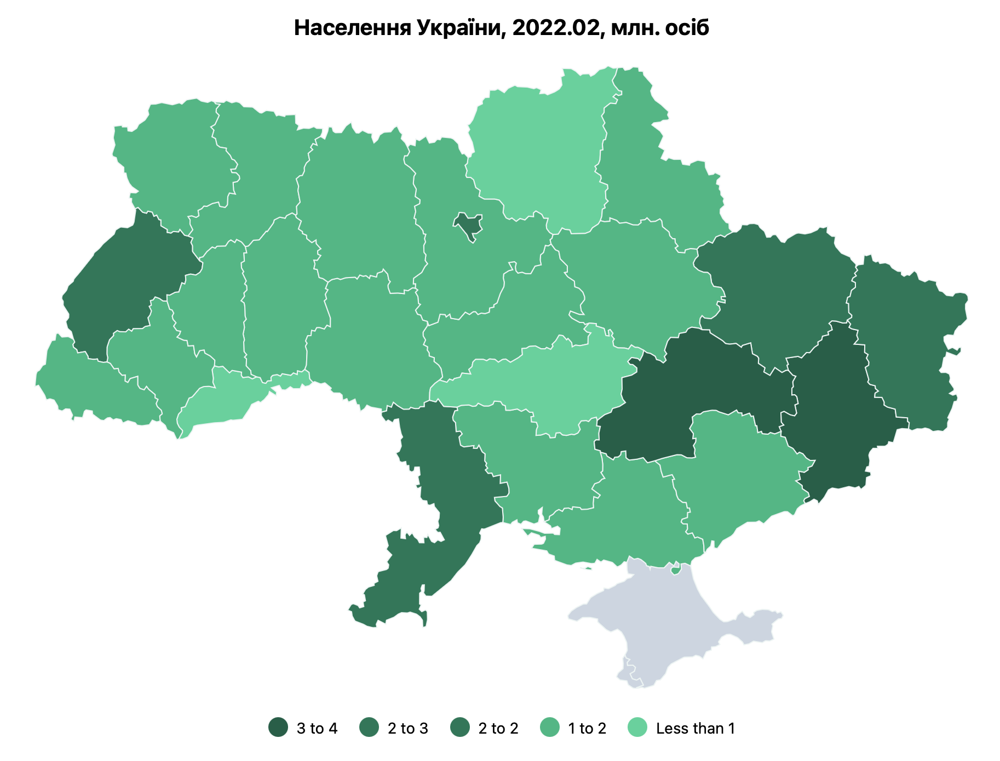

# @dkkoval/react-stats-map

A React component for visualizing data on geographic maps by region. This package provides a flexible way
to present regional data visually, creating a choropleth map representation where each region is colored
based on its data value.



## Features

* Display a custom map with regions colored based on provided data.
* Supports tooltip interactions to display additional information about each region.
* Easily integrates with responsive containers to automatically adjust to the size of the parent component.
* Compatible with custom maps using TopoJSON data.

## Installation

Install the package with npm or yarn:

```sh
npm install @dkkoval/react-stats-map
```

or

```sh
yarn add @dkkoval/react-stats-map
```

## Usage

Here’s an example of how to use the StatsMap component in a React application with a custom map file.

```jsx
import * as topojson from 'topojson-client';
import StatsMap, { MapStyle, ThresholdColor } from '@dkkoval/react-stats-map';

// Example TopoJSON data and types
import topology from './assets/maps/regions.json';
import { RegionCode } from './types'; // 'CODE1' | 'CODE2' | 'CODE3'

// Extract features from TopoJSON
const { features } = topojson.feature(
  topology,
  topology.objects.regions
) as topojson.FeatureCollection;

export interface CustomMapProps {
  width: number;
  height: number;
  data: Record<RegionCode, number>;
  valueName: string;
  title: string;
  hideLegend?: boolean;
  hideTitle?: boolean;
  mapStyle?: MapStyle;
  thresholdColors?: ThresholdColor[];
}

// Custom Map Component using StatsMap
export function CustomMap(props: CustomMapProps) {
  return (
    <StatsMap
      {...props}
      topojsonFeatures={features}
      nameAccessor={(f) => f.properties.NAME}  // Accessor for region names
      codeAccessor={(f) => f.id}               // Accessor for region codes
    />
  );
}
```

### Explanation

In this example, we create a CustomMap component using StatsMap:

* `topojsonFeatures`: The map data, extracted from a TopoJSON file, defines the shapes and boundaries of each region.
* `nameAccessor`: Specifies how to retrieve each region's name, which is used for tooltips and labels.
* `codeAccessor`: Defines how to retrieve each region's unique code, which is used to match data values to specific regions.

### Props for StatsMap

* `width`: Width of the map (number).
* `height`: Height of the map (number).
* `data`: Object containing data values for each region, where keys are region codes.
* `valueName`: The label for the type of data being visualized (e.g., "population density").
* `title`: Title displayed above the map.
* `hideLegend`: Boolean to hide the legend (optional).
* `hideTitle`: Boolean to hide the title (optional).
* `mapStyle`: Style options for customizing map appearance (optional).
* `thresholdColors`: Array of colors to define the range for choropleth visualization (optional).

## License

This project is licensed under the Apache-2.0 License. See the [LICENSE](./LICENSE.txt) file for details.

## Contributing

Contributions are welcome! Feel free to open an issue or submit a pull request if you have suggestions or improvements.

## Contact

Created by Dmytro Koval. Reach out via GitHub for any questions or feedback.
