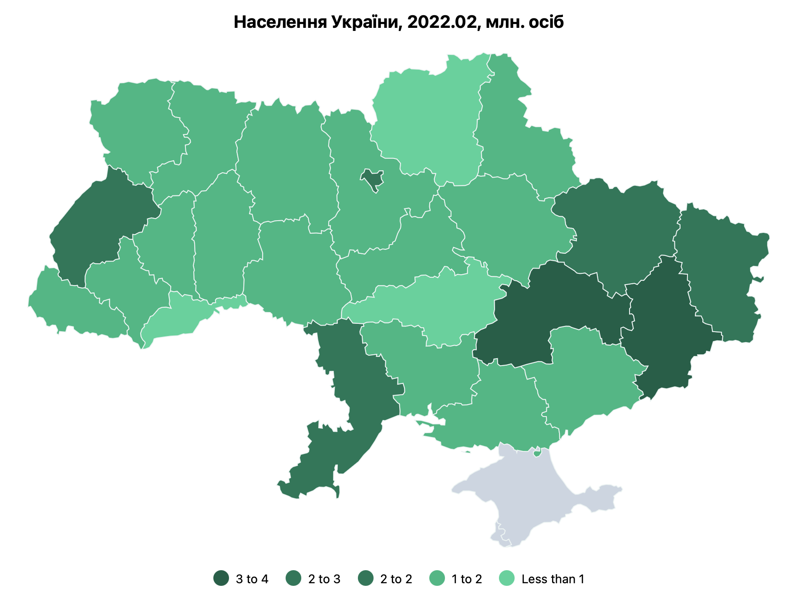

# @dkkoval/react-ua-map

A React component for visualizing data on a map of Ukraine by oblast. This package makes it easy to present regional data visually, providing a choropleth map representation of Ukrainian oblasts (regions).



## Features
- Display a map of Ukraine with individual oblasts colored based on provided data.
- Supports tooltip interactions to display additional information about each oblast.
- Easy integration with responsive container components to make the map adjust to the size of the parent.

## Installation

To install the package, use npm or yarn:

```sh
npm install @dkkoval/react-ua-map
```

or

```sh
yarn add @dkkoval/react-ua-map
```

## Usage

Here is an example of how to use the `UAMap` component in a React application.

### Example

```jsx
import populationJson from './population.json';
import UAMap, { getOblastCode, OblastCode } from '@dkkoval/react-ua-stats-map';

// Assuming the json file has title and value name
interface StatsData {
  title: string;
  valueName: string;
  data: {
    [region: OblastCode]: number;
  };
}

// Helper function to convert region names to oblast codes
function transformDataKeys(data: Record<string, number>): Record<OblastCode, number> {
  const transformedData: Partial<Record<OblastCode, number>> = {};

  Object.entries(data).forEach(([key, value]) => {
    const code = getOblastCode(key);
    if (code) {
      transformedData[code] = value;
    }
  });

  return transformedData as Record<OblastCode, number>;
}

function App() {
  const { data: rawData, title, valueName }: StatsData = populationJson;

  const data = transformDataKeys(rawData);

  return (
    <div className='App' style={{
      width: '90vw',
      height: '90vh',
      border: '1px solid #eee',
      display: 'flex',
      justifyContent: 'center',
      alignItems: 'center',
      margin: '24px',
    }}>
      <UAMap
        width={800}
        height={500}
        title={title}
        valueName={valueName}
        data={data}
      />
    </div>
  );
}

export default App;
```

### Props

- **width**: The width of the map (number).
- **height**: The height of the map (number).
- **title**: A string to display as the map title.
- **valueName**: The unit or type of data being visualized (e.g., "milions people").
- **data**: An object representing the values to display for each oblast, where the keys are oblast codes and values are numerical data.

### Oblast Codes

The `data` prop should use oblast codenames as keys to identify different regions. The oblast codes used are:

| Oblast Name                 | Code |
|-----------------------------|------|
| Черкаська область           | CK   |
| Чернігівська область        | CH   |
| Чернівецька область         | CV   |
| Автономна республіка Крим   | KR   |
| Дніпропетровська область    | DP   |
| Донецька область            | DT   |
| Івано-Франківська область   | IF   |
| Харківська область          | KK   |
| Херсонська область          | KS   |
| Хмельницька область         | KM   |
| Київська область            | KV   |
| Київ                        | KC   |
| Кіровоградська область      | KH   |
| Луганська область           | LH   |
| Львівська область           | LV   |
| Миколаївська область        | MY   |
| Одеська область             | OD   |
| Полтавська область          | PL   |
| Рівненська область          | RV   |
| Севастополь                 | SC   |
| Сумська область             | SM   |
| Тернопільська область       | TP   |
| Закарпатська область        | ZK   |
| Вінницька область           | VI   |
| Волинська область           | VO   |
| Запорізька область          | ZP   |
| Житомирська область         | ZT   |

### Helper Functions

- **getOblastCode(name: string): OblastCode | undefined**: Converts a string representing the oblast name into the corresponding oblast code. This function is useful for transforming user-provided or external data to match the required format.

## License

This project is licensed under the Apache-2.0 License. See the [LICENSE](LICENSE.txt) file for details.

## Contributing

Contributions are welcome! Feel free to open an issue or submit a pull request if you have any suggestions or improvements.

## Contact

Created by Dmytro Koval. You can reach out via GitHub for any questions or feedback.
